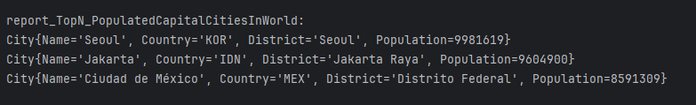
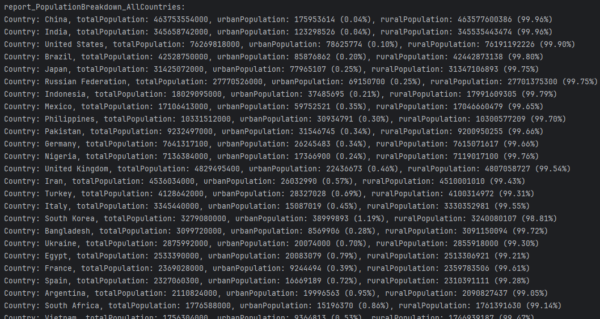

# SET08103---2024-5
Napier University Team project for SET08103 module 2024/2025

* Main Build status 

* Develop Build status 

* License 

* Release  

* Codecov Coverage 

## Team Members
- **Stephen Banks**
- **Rachael Banks**
- **Nikita Lanetsky**
- **Thomas Smith**

## Links
- [Code of Conduct](./CODE_OF_CONDUCT.md)
- [Kanban Board](https://zube.io/napier-366/set08103/w/workspace-1/kanban)
- [Team Contribution Excel](https://livenapierac-my.sharepoint.com/:x:/r/personal/40690823_live_napier_ac_uk/Documents/Software%20Engineering%20Methods.xlsx?d=w7f256f84d5e14544a8583b75cf1caf37&csf=1&web=1&e=AeA08L)

## Requirements
### 32 out of 32 of the requirements have been met which is 100%

| ID | Name                                                                                                  | Met | Screenshot                                           |
|----|-------------------------------------------------------------------------------------------------------|-----|------------------------------------------------------|
| 1  | All the countries in the world organised by largest population to smallest.                           | Yes |    |
| 2  | All the countries in a continent organised by largest population to smallest.                         | Yes |    |
| 3  | All the countries in a region organised by largest population to smallest.                            | Yes |    |
| 4  | The top N populated countries in the world where N is provided by the user.                           | Yes |    |
| 5  | The top N populated countries in a continent where N is provided by the user.                         | Yes |    |
| 6  | The top N populated countries in a region where N is provided by the user.                            | Yes |    |
| 7  | All the cities in the world organised by largest population to smallest.                              | Yes |    |
| 8  | All the cities in a continent organised by largest population to smallest.                            | Yes |    |
| 9  | All the cities in a region organised by largest population to smallest.                               | Yes |    |
| 10 | All the cities in a country organised by largest population to smallest.                              | Yes |  |
| 11 | All the cities in a district organised by largest population to smallest.                             | Yes |  |
| 12 | The top N populated cities in the world where N is provided by the user.                              | Yes |  |
| 13 | The top N populated cities in a continent where N is provided by the user.                            | Yes |  |
| 14 | The top N populated cities in a region where N is provided by the user.                               | Yes |  |
| 15 | The top N populated cities in a country where N is provided by the user.                              | Yes |  |
| 16 | The top N populated cities in a district where N is provided by the user.                             | Yes |  |
| 17 | All the capital cities in the world organised by largest population to smallest.                      | Yes |  |
| 18 | All the capital cities in a continent organised by largest population to smallest.                    | Yes |  |
| 19 | All the capital cities in a region organised by largest to smallest.                                  | Yes |  |
| 20 | The top N populated capital cities in the world where N is provided by the user.                      | Yes |  |
| 21 | The top N populated capital cities in a continent where N is provided by the user.                    | Yes |  |
| 22 | The top N populated capital cities in a region where N is provided by the user.                       | Yes |  |
| 23 | The population of people, people living in cities, and people not living in cities in each continent. | Yes |  |
| 24 | The population of people, people living in cities, and people not living in cities in each region.    | Yes |  |
| 25 | The population of people, people living in cities, and people not living in cities in each country.   | Yes |  |
| 26 | The population of the world.                                                                          | Yes |  |
| 27 | The population of a continent.                                                                        | Yes |  |
| 28 | The population of a region.                                                                           | Yes |  |
| 29 | The population of a country.                                                                          | Yes |  |
| 30 | The population of a district.                                                                         | Yes |  |
| 31 | The population of a city                                                                              | Yes |  |
| 32 | Language report.                                                                                      | Yes |   |
